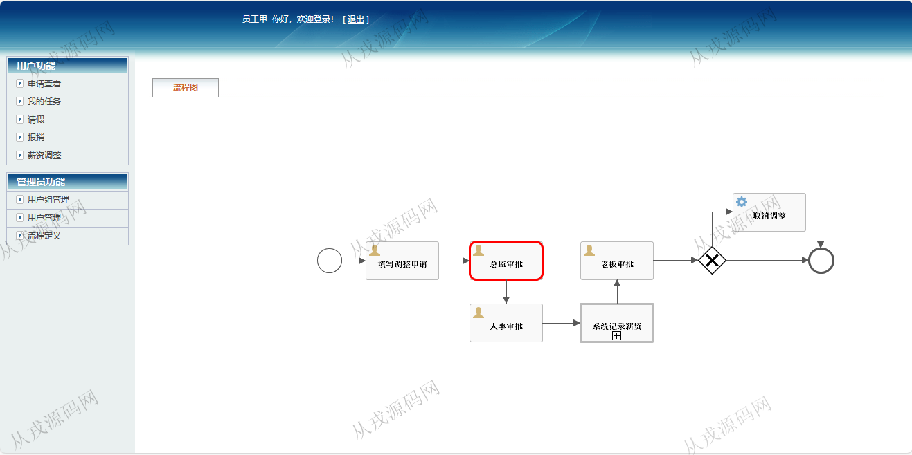
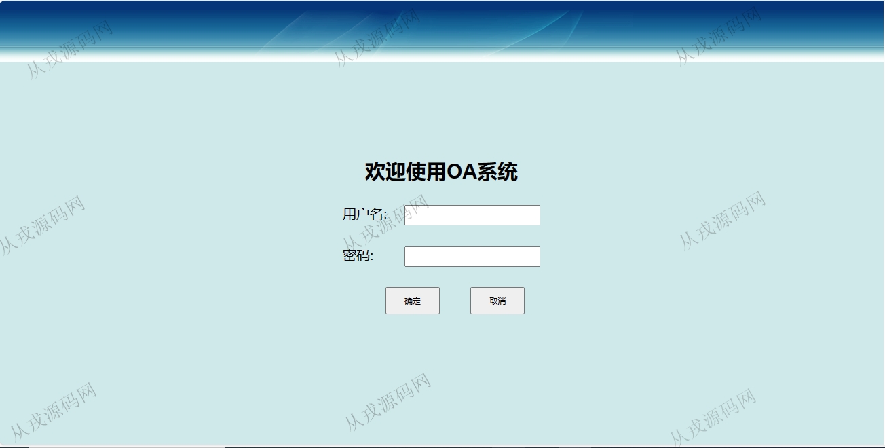
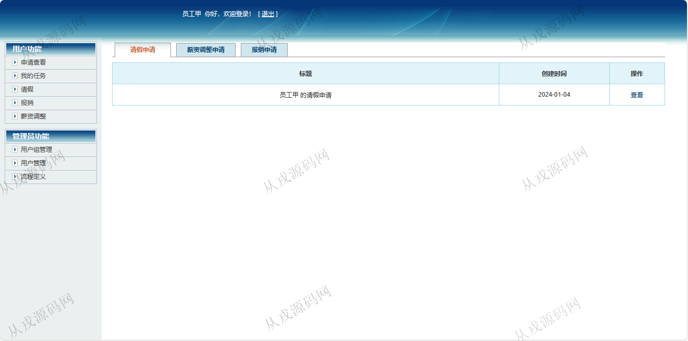
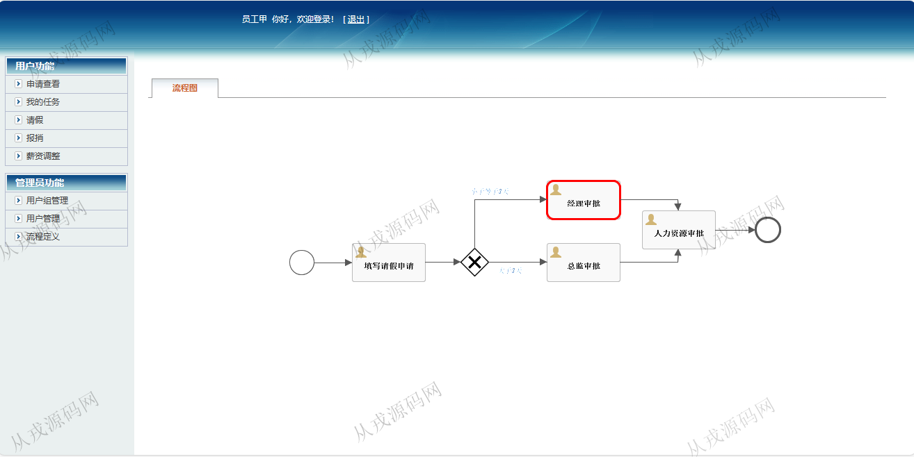
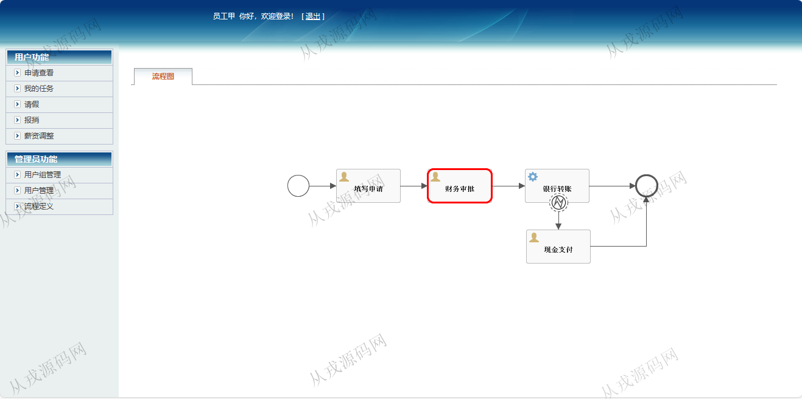
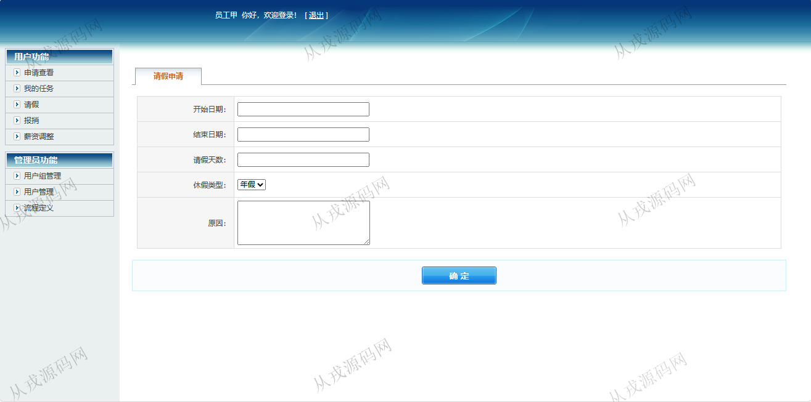
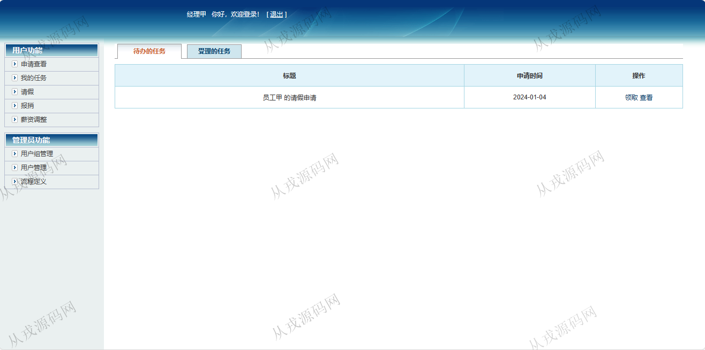
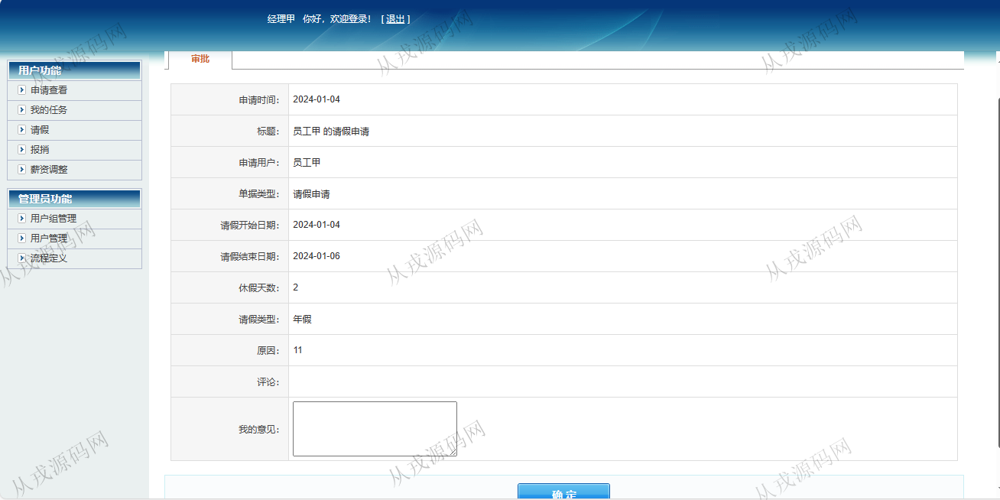
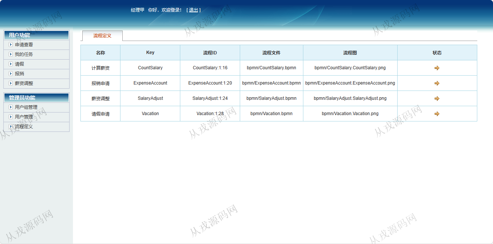

<h1 align="center">105.OA工作流管理系统</h1>

 获取sql文件 QQ: 386869957 QQ群: 377586148 

 [推荐站点: 从戎源码网](https://armycodes.com/) 

## 简介

> 本代码来源于网络,仅供学习参考使用!
>
> 提供1.远程部署/2.修改代码/3.设计文档指导/4.框架代码讲解等服务
> 
> 登录地址：http://localhost:8080/login.jsp
> 
> 员工：员工甲 123456
> 财务：财务甲 123456
> 老板：老板甲 123456
> 人事：人事甲 123456
> 总监：总监甲 123456
> 经理：经理甲 123456
>

## 项目介绍
基于ssh的就业信息平台管理系统：前端 jsp、jquery，后端 struts、spring、hibernate，角色分为员工、财务、老板、人事、总监、经理；集成请假流程审批、报销流程、薪资调整流程等功能于一体的系统。

## 功能介绍

请假：填写请假申请，小于等于3天总经理审批，大于3天总监审批，人力资源审批
报销：填写报销申请，财务审批，银行转账
薪资调整：填写调整申请，总监审批，人事审批，系统记录薪资，老板审批
申请查看：申请列表查询，详情查看
我的任务：代办任务，受理的任务

## 环境

- <b>IntelliJ IDEA 2021.3</b>

- <b>Mysql 5.7.26</b>

- <b>Tomcat 7.0.73</b>

- <b>JDK 1.8</b>

## 运行截图

